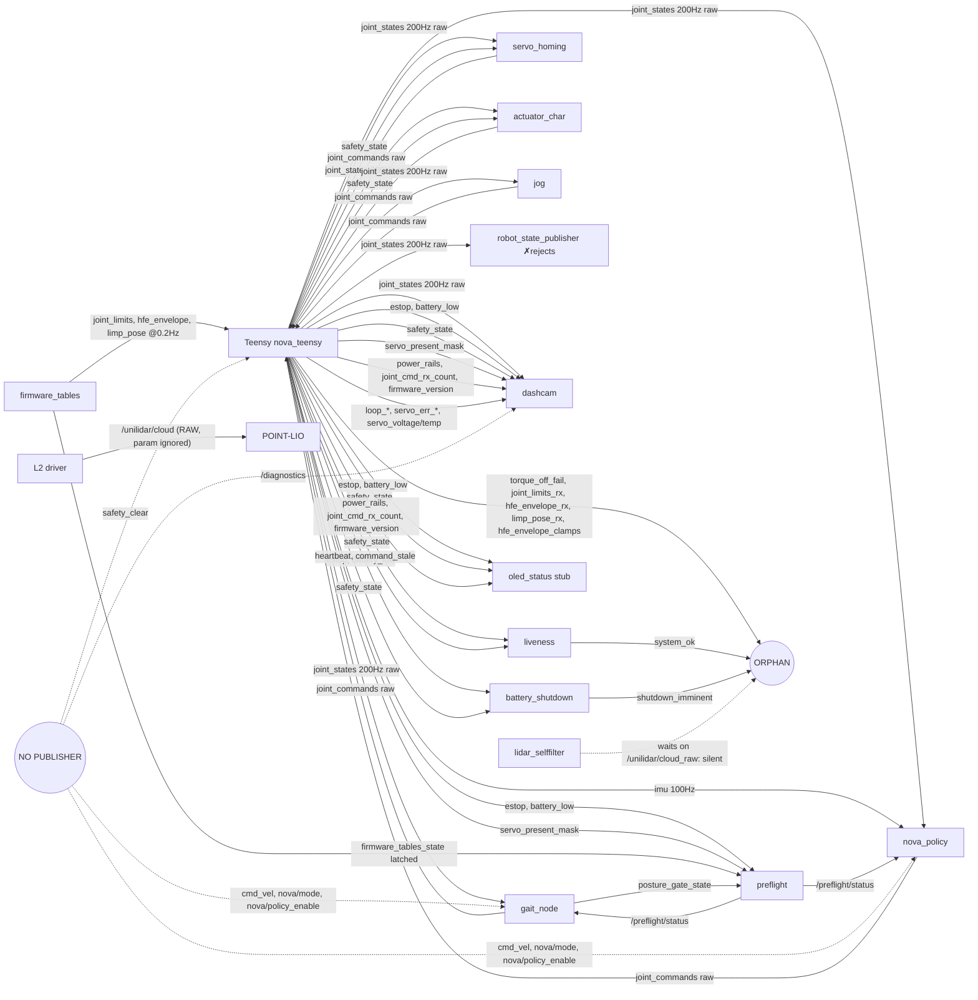

# Comms + telemetry map (audit, 2026-09-25)

Read-only audit of every inter-system link, taken at `origin/main` fbbb5f9. The robot is not
assembled, so **nothing here has run end to end on hardware.** In this doc, "verified" means a
test exercises the link and the test is named. Both ends of every topic were grepped:
`create_publisher` / `create_subscription` across `ros2_ws/src`, and `rclc_*_init` in `main.cpp`.

Status key:
- **OK**: tested at the logic level (native or pytest).
- **WRITTEN**: the code exists, but no test crosses the seam.
- **MISMATCH**: the two ends disagree.
- **BROKEN**: it cannot work as wired.

Baselines on this tree: `pio test -e native` gives 134/134, and the ROS pytest gives 409/409.

## 1. Link table

| # | Link | Transport | Messages / topics | Rate | Units / frame | Verified by | Status | Notes (file:line) |
|---|---|---|---|---|---|---|---|---|
| 1 | Teensy ↔ 12× STS3215 | UART1 1 Mbaud half-duplex via 74HC125 (OE pins 2/3) | READ 0x38..0x3F (pos, vel, load, V, °C); SYNC_WRITE goal | 3 polls/tick → **50 Hz per joint**; SYNC_WRITE 100 Hz | raw counts; vel bit-15 s-m; load bit-10 s-m ‰ | `test_feetech_protocol`, `test_feetech_bus`, `test_bus_timing`, `test_servo_fleet`, `test_slew_limiter`, `test_hfe_envelope` | OK (native) | read timeout 2500 µs `main.cpp:323`; stall guard 900‰ × 5 reads or 70 °C `main.cpp:269-295`; F8, F9 |
| 2 | Teensy → Jetson `/joint_states` | micro-ROS / USB-CDC, RELIABLE | `sensor_msgs/JointState`, `name[]` empty | 200 Hz (every tick) | raw counts; effort ‰ of stall; **stamp = Teensy `millis()`** | none crosses the transport | MISMATCH | `main.cpp:1366-1374`; F2, F10 |
| 3 | Jetson → Teensy `/joint_commands` | same | `JointState.position[12]`, bus-ID order | gait 100 Hz, policy 50 Hz | **raw counts** after `_CountsAdapter` | `test_counts_adapter_log`, `test_firmware_limits::test_round_trip_survives_an_inverted_joint`, `test_safety_envelope` | OK (host) | 6 publishers, no mux; stale freeze after 500 ms `main.cpp:46-47,1246-1263` |
| 4 | Jetson → Teensy protection tables | same | `/joint_limits` (24 f), `/hfe_envelope` (385 f), `/limp_pose` (12 f) | every 5 s | raw counts | `test_firmware_tables`, `test_firmware_limits`, `test_hfe_envelope` (native) | MISMATCH | acks `/…_rx` have no subscriber; F5, F6, F16 |
| 5 | Safety state → Jetson | same | `/estop`, `/battery_low` (Bool), `/safety_state` (Int32 0-3), `/command_stale` | on each edge + 1 Hz refresh | True = pressed / low | `test_safety_fsm`, `test_liveness`, `test_battery_shutdown`, `test_preflight` | OK | `main.cpp:1344-1361,1404-1409` |
| 6 | Operator → Teensy `/safety_clear` | same | `Bool` | event | – | `test_safety_fsm` (FSM only) | WRITTEN | no publisher in the repo, so it only works from the CLI; F13 |
| 7 | Teensy diag counters | same | `/heartbeat`, `/loop_*_us`, `/tick_missed_count`, `/servo_*err*`, `/servo_present_mask`, `/torque_off_fail`, `/servo_voltage`, `/servo_temperature`, `/firmware_version` | 1 Hz (voltage/temp 5 Hz, version 0.1 Hz) | ints; V; °C | `test_telemetry_schedule`, `test_loop_timing`, `test_firmware_topic_contract` (names only) | MISMATCH | `/torque_off_fail` is orphaned; F7 |
| 8 | ICM-42688 → `/imu` | I²C 0x68 (400 kHz) → micro-ROS | `sensor_msgs/Imu`: tilt quaternion (yaw 0), rad/s, m/s² | chip read 200 Hz, **published 100 Hz, only if `imu_ok`** | chip axes are assumed to equal body axes; stamp 0; `frame_id` empty | `test_icm42688`, including `test_quaternion_roundtrip_matches_policy_node` | WRITTEN | #14: driver done, part not owned; `main.cpp:1459-1478` |
| 9 | INA226 ×4 → `/power_rails` | I²C 0x40 / 41 / 44 / 45 | `Float32MultiArray`, 12 f `[V,A,W]` × leg, hip, jetson, l2 | 1 rail per tick → 50 Hz each; published 10 Hz | V, A, W; **NaN on dropout** | `test_rail_sample`, `test_firmware_topic_contract::test_power_rails_width…` | WRITTEN | consumers are the OLED stub and dashcam only; F15 |
| 10 | E-stop J21 / BATT_LOW → Teensy | GPIO pin 5 (pull-up, HIGH = pressed), pin 4 (R8 10k to +3V3) | – | read every tick | – | `test_safety_fsm`, `test_limp_controller` | OK (native) | net check: J21.1 → U6.T5, BATT_LOW → U6.9. HARDCUT never reaches the Teensy (power-board only). #430 still open |
| 11 | micro-ROS agent lifecycle | `micro_ros_agent serial /dev/ttyACM0` | 27 pubs / 5 subs, all `_default` = RELIABLE + VOLATILE | – | – | `test_firmware_entity_caps` + CI `config.h` check | BROKEN | not started by any launch or unit; F1, F4 |
| 12 | Jetson ↔ Arduino Nano (OLED + WS2812) | USB-serial `/dev/ttyUSB0` 115200 | proposed `STATE` / `LINE` text protocol | 1 Hz | – | none | WRITTEN (stub) | no sketch exists (`firmware/arduino-nano/README.md`); `oled_status/node.py:100-105` is a no-op. No Teensy link: the Nano nets are SPI and LED only (`07_aux_mcu`) |
| 13 | L2 → self-filter → POINT-LIO | UDP 192.168.1.62 → .2; ROS | `/unilidar/cloud_raw` → `/unilidar/cloud`, `/unilidar/imu` 250 Hz | 12 Hz cloud | `unilidar_lidar` frame | `test_bringup_profiles::test_slam_lidar_selffilter_is_wired…` (profile dict only) | BROKEN | F3 (#441 fix is inert) |
| 14 | D456 → Jetson | USB3, `realsense2_camera rs_launch.py` | color, depth, accel, gyro | driver default | – | none | WRITTEN | recorded only (dashcam `PERCEPTION_TOPICS`, not V1) |
| 15 | `/joint_states` → `robot_state_publisher` → `/tf` | ROS | – | – | – | none | MISMATCH | F10 |
| 16 | Policy ↔ sim contract | – | 105-d obs, 12 actions | 50 Hz | rad, rad/s, proj_grav | `test_policy_runner`, `sim/nova_mjx/deploy/test_policy_contract.py`, `test_joint_map`, `test_urdf_sync` | MISMATCH | #425 is not merged; F11, F12 |
| 17 | Jetson systemd watchdog | `sd_notify` | `/watchdog_fed` | 0.2 Hz | – | `test_watchdog` | OK | |

**Count:** OK 5 (rows 1, 3, 5, 10, 17) · WRITTEN 5 (6, 8, 9, 12, 14) · MISMATCH 5 (2, 4, 7, 15, 16) · BROKEN 2 (11, 13).

## 2. Topic graph

## 3. Findings (severity order)

**F1 HIGH NEW: a USB or agent loss leaves the servos torqued with no supervision.**
- Every firmware publisher is RELIABLE (`rclc_publisher_init_default`, `main.cpp:935-1096`).
- `rmw_publish` blocks in `uxr_run_session_until_confirm_delivery` for up to `RMW_UXRCE_PUBLISH_RELIABLE_TIMEOUT` = 1000 ms. Sources: rmw_microxrcedds humble `rmw_publish.c:79-84` and `CMakeLists.txt:66`. `nova_microros.meta` does not override it.
- With no agent, the first publish stalls the loop for about 1 s, which trips the software watchdog (200 ticks = 1 s, `main.cpp:564-589`) and resets the Teensy.
- The watchdog path does not disarm, and `setup()` never disarms either. Its comment at `main.cpp:712-713` assumes a limp fleet, which is only true after a cold power-up.
- After a warm reset the servos keep `TORQUE_ENABLE=1` at their last goal. `rclc_support_init` then retries forever (`main.cpp:929`), with no stall guard, overtemp guard or battery-low limp running. The `command_stale` freeze never runs.
- Proposed fix, one line and root-cause: `servo_fleet.disarm(0x0FFF)` right after `servo_bus.begin()` in `setup()`. Then make the telemetry publishers best-effort, or shorten the reliable timeout in the meta. Optionally add an `rmw_uros_ping_agent` reconnect loop so the safety loop keeps running while offline.
- Bench step for #431: pull the USB cable with the servos powered and watch the LED and the torque.

**F2 HIGH NEW, proven: the wrapper's load refusal can never fire on hardware.** ⚠ **FIXED 2026-09-25 in #470** (stamp on arrival + uptime-stamp test).
- `/joint_states` is stamped with Teensy uptime (`main.cpp:1371-1373`).
- `wrapper.py:174-178` stores that stamp, and `_load_window` compares it against ROS wall time (`wrapper.py:193-200`, `now_ns` at `:276`), so no sample is ever inside the 0.3 s window.
- Probe, not committed: with the fake clock set to 1.79e18 ns and `header.stamp.sec=120`, an 85% load does not stop the 0.1 → 0.163 rad move. The same message stamped with wall time is held.
- The repo tests pass because their fake message has no header and the fake clock starts at 0.
- Fix: stamp samples on receipt (drop the header branch), and add a test with an uptime stamp. The firmware-side alternative is an `rmw_uros_sync_session` epoch stamp.

**F3 HIGH, KNOWN #441: not fixed on main, because the fix is inert.**
- `bringup/__init__.py` (slam) passes the launch argument `cloud_topic:=/unilidar/cloud_raw`.
- `Ace2932/unilidar_sdk2` `launch.py` (on `main` and on `fix/imu-bridge-double-call`) declares no launch arguments and hardcodes the parameter `'cloud_topic': "unilidar/cloud"`. The argument is silently dropped.
- The driver publishes the raw cloud on `/unilidar/cloud`, the self-filter waits on `/unilidar/cloud_raw`, and POINT-LIO maps the ears.
- `test_bringup_profiles` checks the dict, not the driver.
- Fix: launch the driver as a `node` action with `cloud_topic` set as a parameter, or add `DeclareLaunchArgument` in the fork.

**F4 MED-HIGH NEW: nothing starts or respawns `micro_ros_agent`.**
- Profiles explicitly don't start it (`bringup/__init__.py:97-99`). `deploy/nova-bringup.service` runs `profile:=walk` only, and the agent is launched by hand with `setsid` (`docs/setup-jetson.md` §14.7, `scripts/deploy-firmware.sh:229-233`).
- On a cold robot boot the Teensy waits forever, and an agent crash is never restarted.
- Fix: add a `micro-ros-agent.service` (`Restart=always`, a udev symlink by Teensy serial rather than `ttyACM0`) ordered before bringup. Also, `setup-jetson.md` "handshake never completes" is stale, since `main.cpp:929` retries.

**F5 MED NEW: the firmware's table acks are never read.**
- `/joint_limits_rx`, `/hfe_envelope_rx`, `/limp_pose_rx` and `/hfe_envelope_clamps` have zero subscribers.
- `preflight/checks/firmware_tables.py:10-17` says it should require them "once #186 lands". #186 and #187 are both closed and the check was never updated, so a table the Teensy rejected still passes preflight.
- Fix: require `*_rx > 0` (VOLATILE QoS) consistent with `firmware_tables_state`.

**F6 MED NEW: the Teensy runs wide open for up to 5 s after a reboot or reconnect.**
- Tables are re-sent only every `republish_period_s = 5 s` (`tables_node.py:62`), while gait and policy stream commands at once.
- Fix: republish when `/heartbeat` restarts. `liveness` already detects that; see `teensy_reset_count`.

**F7 MED NEW: `/torque_off_fail` (#437) is built but not connected.**
- There is no subscriber, it is not in dashcam `V1_TOPICS`, and no preflight check reads it.
- It will also likely count on every E-stop: the hardware E-stop cuts the servo bucks, so each per-servo read-back times out. That costs 12 × 3 tries ≈ 108 ms blocking (`servo_fleet.h`, disarm).
- Fix: count only servos that answer with TORQUE_ENABLE = 1, record the topic, and alarm on it.

**F8 MED NEW: there is no per-joint freshness signal.**
- A servo that stops answering keeps publishing its last pos/vel/load forever.
- `servo_present_mask` means "ever answered" and is never cleared (`main.cpp:250-253,335`). `ServoFleet::lost_` is internal.
- Gait and policy consume frozen joints.
- Fix: publish the lost mask, or put NaN in that joint's fields, and gate the policy on it.

**F9 MED NEW: absent servos overrun the tick.**
- 3 polls × 2500 µs timeout = 7.5 ms, against a 5 ms tick (`main.cpp:323`, `telemetry_schedule.h`).
- This happens on a partial bench fleet and after every E-stop, because the bucks go down. `tick_missed` climbs and every tick-derived rate slows.
- `test_bus_timing` only models the all-present case.
- Fix: a timeout around 600 µs (servo turnaround is about 150 µs, `main.cpp:320`), plus poll present servos first and re-probe one absent servo per tick.

**F10 MED NEW: `robot_state_publisher` rejects the firmware's `/joint_states`.**
- The message has `name[]` empty and 12 positions, which RSP humble `robot_state_publisher.cpp:301-309` ignores, logging an error each time at 200 Hz. Leg TF is never published.
- Even if names were added, the values are raw counts, not radians.
- Fix: a host republisher (`/joint_states_rad`, named, via `convert_positions`), with RSP remapped to it.

**F11 MED NEW (sim ↔ robot, related to #428): the firmware rate limit is missing from sim.**
- Firmware slew is 20 counts per 10 ms ≈ **3.07 rad/s** (`main.cpp:381-388`), and the wrapper caps at 180 °/s.
- The sim applies targets with only latency plus deadband (`env.py:635-646`), with `ACTION_SCALE` = 0.4 rad per 20 ms step.
- Whether the trot needs more than 3 rad/s is unmeasured.
- Fix: log the target-rate p99 from a rollout, then either add the slew to `env.step` or raise `NOVA_SLEW_MAX_DELTA`.

**F12 LOW-MED NEW: several robot inputs don't match the sim's assumptions.**
- The sim models no observation delay. On the robot each joint is 0-20 ms stale, all 12 share one stamp, and `/imu` is 100 Hz.
- The velocity register is assumed to be steps/s (`policy_node.py:166-170`).
- There is no IMU mount rotation.
- `/cmd_vel` is fed raw (`policy_node.py:332-333`), because #425 is still an open PR (`fix/policy-cmd-clip`). The sim box is vx −0.15..0.35, vy ±0.15, wz ±0.5 (`env.py:428-429`). ⚠ superseded: #425 merged 2026-09-25 (clip in `NovaPolicy.build_obs`).

**F13 LOW NEW: topics with no publisher, or no consumer.**
- No publisher: `/diagnostics` (dashcam subscribes, `dashcam/node.py:107`), `/safety_clear`, `/cmd_vel`, `/nova/mode`, `/nova/policy_enable`. The last three are operator topics; there is no teleop in the repo.
- No subscriber: `/system_ok` (gait and policy ignore the liveness verdict), `/shutdown_imminent`, `/watchdog_fed`, `/safety_envelope_counters`, `nova_calibration_status`.

**F14 LOW NEW: dashcam coverage gaps.**
- `V1_TOPICS` omits `/imu`, `/command_stale`, `/heartbeat`, `/torque_off_fail`, the table acks, and `/nova/*`.
- `PENDING_TOPICS` still lists `/imu/mpu6050/data`, which was cut.

**F15 LOW NEW: documentation drift.**
- The firmware README says `/joint_states` is "~17 Hz per joint"; it is 50.
- It says `/joint_commands` is broadcast "at 40 Hz"; it is 100.
- It says `/estop` "LOW = pressed". The published value is True = pressed, and `preflight/checks/estop.py:6` agrees with the code.
- It calls `/estop` and `/battery_low` "edge-change"; they also refresh at 1 Hz.
- `main.cpp:229-233` still says "one read per tick".
- `ina226_telemetry.h` claims one-shot, 3 rails, 66 Hz.
- The OLED shows `leg_v` (the 7.5 V buck output) as "BAT", with no NaN check (`oled_status/node.py:95-117`).

**F16 LOW NEW: the transport, not the firmware, caps the `hfe_envelope` payload.**
- The XRCE input reliable stream is MTU 512 × history 4 ≈ 2 KiB (upstream defaults; `common.meta` and `colcon.meta` don't override them).
- 24 buckets is about 1.56 KiB and fits. The firmware accepts up to 40 buckets, about 2.6 KiB, and the agent would drop that silently.
- `test_the_payload_FITS_the_firmware_buffer` checks against 40, not against the transport.

**F17 LOW NEW: nothing arbitrates `/joint_commands`.**
- It has 6 publishers. Profiles keep gait and policy apart, but jog or homing run beside `walk` would interleave.

**KNOWN, status on main:**
- Publisher cap: **fixed**. `nova_microros.meta` sets 32/8, `test_firmware_entity_caps`, and the CI `config.h` check.
- RCCHECK: **fixed**. It now cuts torque and resets (`main.cpp:719-725`).
- Load sign bit 10: **fixed** (`feetech_protocol.h:187-195`, `main.cpp:332`).
- #420 and #426: fixed.
- #451, #447 and #449: merged.
- #425: **not merged**. ⚠ superseded: merged 2026-09-25 (2b92cf5).
- #441: inert (F3).
- #429, #430 and #431: open, bench-gated.
- Topic-contract gate: **merged** as #343 (pubs), #344 (subs) and #349 (`power_rails` width). It covers `main.cpp` ↔ firmware README *names* only: no types, rates or QoS, and it does not check that a host node sits on the other end. That missing check is the one that finds F5, F7, F10 and F13.

## 4. SIL harness: what exists, and the smallest one that catches these bugs

**Exists today:**
- `pio test -e native`: 12 suites and 134 cases of pure firmware logic, with `test/mock_arduino`.
- ROS pytest: 409 cases, pure Python, no rclpy.
- CI builds the full micro-ROS firmware in `ros:humble` (`firmware-compile.yml`).
- The MJX sim.

**Missing:** nothing runs a ROS graph, the agent, or `main.cpp` itself.

**Plan, smallest first:**

| Stage | What | Catches | Effort |
|---|---|---|---|
| S0 | Extend the contract gate across the seam. Parse `main.cpp` pubs and subs with their types, plus every host `create_publisher` / `create_subscription`. Assert each firmware topic has a host counterpart with the same type, using an allow-list that requires reasons. Runs in the current ros-pytest. | F5, F7, F13, (F10) | 0.5 day |
| S1 | `fake_teensy` rclpy node in the CI `ros:humble` container. It mirrors `main.cpp`'s ROS surface exactly: names, types, RELIABLE+VOLATILE QoS, raw counts, empty `name[]`, `millis()` stamp, 200 Hz, 1 Hz refresh, table-ack counters with the same validation. It drives a first-order servo model at the firmware slew. Launch `walk` / `policy` with `launch_testing`, then assert: load refusal fires under injected load; tables acked before motion; TF published; policy refuses without `/imu`; stale freeze. | F2, F5, F6, F8, F10, F13, #425 | 2-3 days |
| S2 | The real firmware on the host. Build `main.cpp` for Linux: micro-ROS host platform, pty serial, a fake Feetech bus reusing the `test_servo_fleet` fakes, and `IntervalTimer` as a thread. Run it against the real `micro_ros_agent`, kill the agent, and measure the stall, the watchdog and the torque state. (A cheaper stand-in is #431's bench Teensy with no servos, plus a `pkill micro_ros_agent` script.) | F1, F9, F16, QoS / entity caps | 3-5 days |
| S3 | A MuJoCo plant behind the S2 bus model at real rates: 500 Hz physics, round-robin 50 Hz joint reads, 100 Hz IMU, firmware slew and torque cap. Close the loop through `policy_node` and compare against a pure-sim rollout. | F11, F12, #428 | ~1 week |

**Recommendation:** S0 + S1 (about 3 days) plus the 10-line agent-kill check on the real Teensy. That covers every HIGH or MED finding above except F11 and F12, which need S3.
